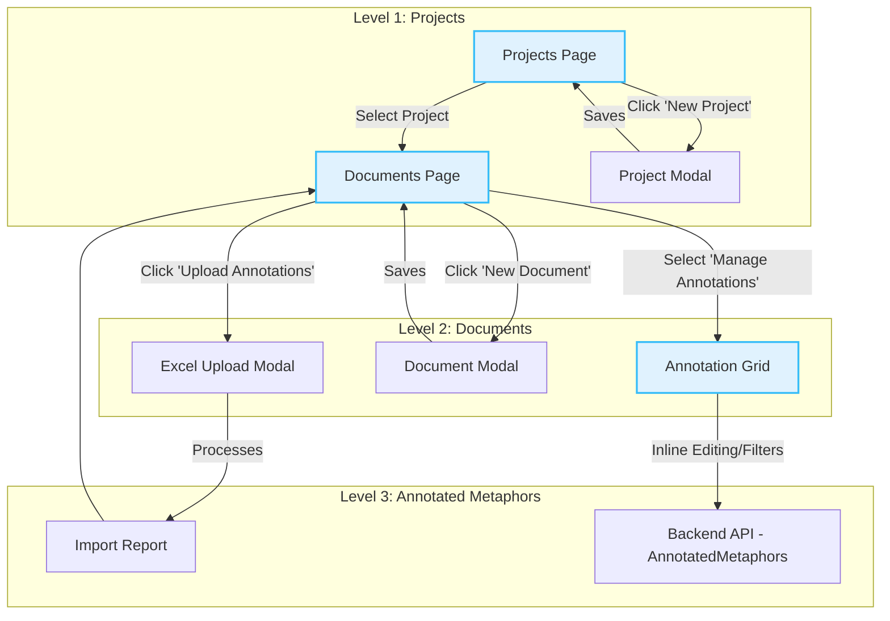

# Application Flow Analysis: Projects, Documents, and Annotated Metaphors

## Overview

This application is designed as a research tool for linguists and analysts. It allows for the organization of work into **Projects**, where each project contains source **Documents**. The core of the system is the ability to analyze these documents to identify, classify, and annotate **Conceptual Metaphors**.

The flow is hierarchical and follows a clear logic: `Projects > Documents > Metaphors`.

---

## Main Flow Diagram

---

## Level 1: Projects

This is the main container for work. A project groups a set of documents related to the same research.

**Functionality:**
- **List Projects:** The main page (`/projects`) displays all existing projects as cards (`ProjectCard.tsx`).
- **Create and Edit:** Through the `ProjectModal.tsx` modal, users can create new projects or edit existing ones (title and description).
- **Navigation:** Clicking on a project card navigates the user to the documents page for that project.

**Technical Components:**
-   **Frontend:**
    -   `pages/projects/index.tsx`: Main page that lists projects.
    -   `components/ProjectCard.tsx`: Individual card for each project.
    -   `components/ProjectModal.tsx`: Form for creating/editing projects.
-   **Backend:**
    -   `projects.controller.ts`: Exposes endpoints for `GET /projects`, `POST /projects`, `PATCH /projects/:id`.
    -   `projects.service.ts`: Business logic for interacting with the database.
    -   `schemas/project.schema.ts`: Defines the structure of a project in MongoDB.

---

## Level 2: Documents

Documents are the text files (PDF, TXT) that serve as the source for metaphor analysis.

**Functionality:**
- **List Documents:** Within a project (`/projects/[projectId]/documents`), associated documents are displayed on cards (`DocumentCard.tsx`).
- **Create and Edit:** The `DocumentModal.tsx` modal allows creating new documents (uploading a file and adding metadata like title, language, etc.) or editing the metadata of an existing one. File uploads are handled via Google Cloud Storage.
- **Open Document:** The original file (PDF or TXT) can be opened in a new tab.
- **Annotation Flows (Entry points to Level 3):**
    - **Manage Annotations:** Opens the `AnnotationGrid`, the main analysis interface.
    - **Upload Annotations:** Opens the `AnnotationUploadModal` for a bulk import of metaphors from an Excel file.

**Technical Components:**
-   **Frontend:**
    -   `pages/projects/[projectId]/documents/index.tsx`: Page that lists documents.
    -   `components/DocumentCard.tsx`: Individual card for each document.
    -   `components/DocumentModal.tsx`: Form for uploading/editing documents.
    -   `components/AnnotationUploadModal.tsx`: Modal for bulk import.
-   **Backend:**
    -   `documents.controller.ts`: Endpoints for `GET`, `POST`, `PATCH`, `DELETE` on documents.
    -   `documents.service.ts`: Business logic, including interaction with Google Cloud Storage for uploading and deleting files.
    -   `schemas/document.schema.ts`: Defines the document structure.

---

## Level 3: Annotated Metaphors

This is the heart of the application, where detailed analysis takes place.

**Functionality:**
- **Grid View (`AnnotationGrid`):**
    - Displays all metaphors from a document in a dense, customizable table.
    - Uses server-side pagination, sorting, and filtering to efficiently handle large volumes of data.
- **Inline Editing:** Users with the appropriate role (`editor`) can click on any cell and edit its value directly. Changes are saved asynchronously.
- **Selection and Bulk Actions:** Allows selecting multiple metaphors to apply bulk status changes (e.g., "Approve", "Discard").
- **Bulk Import (Recently Enhanced Flow):**
    - The user uploads an Excel file via the `AnnotationUploadModal`.
    - Real-time feedback is shown during the upload and server-side processing.
    - Upon completion, a clear **summary** is presented (successes, failures, warnings).
    - A **detailed report** (`ImportReportModal`) can be opened, featuring filters, search, and an option to export errors, allowing the user to understand and correct issues in their data.
- **Export:** Allows exporting filtered data from the grid to an Excel file.

**Related Entities (Domains and POS):**
- `Source/Target Domain` and `POS` (Part of Speech) are separate collections to ensure consistency.
- When an Excel file is imported, if a domain or POS does not exist, it is created automatically (`findOrCreate` in the corresponding services).
- In the `AnnotationGrid`, the lists of domains and POS are loaded into the editing dropdowns, sorted alphabetically for ease of use.

**Technical Components:**
-   **Frontend:**
    -   `pages/projects/[projectId]/documents/[documentId]/annotations.tsx`: Page that renders the grid.
    -   `components/AnnotationGrid.tsx`: Main component that implements the table with `@tanstack/react-table`. Manages table state, API calls for data fetching, and editing functions.
-   **Backend:**
    -   `annotated-metaphors.controller.ts`: Endpoints for `GET` (with filters), `PATCH` (inline editing), `POST` (bulk actions), and bulk import from Excel (`bulk-import`).
    -   `annotated-metaphors.service.ts`: Complex business logic, including Excel processing, on-the-fly creation of domains/POS, and building the detailed report.
    -   `domains.service.ts` and `pos.service.ts`: Dedicated services for managing these entities.
    -   `schemas/annotated-metaphor.schema.ts`, `domain.schema.ts`, `pos.schema.ts`: Define the data structures.

---

## Conclusion of Analysis

The application's flow is well-structured and robust. The three-level separation (Project, Document, Metaphor) is logical and scalable. Recent enhancements to the bulk import flow have added a much-needed level of feedback and usability, transforming a potential source of frustration into a powerful diagnostic tool for the user. The backend architecture, with dedicated services for each entity, promotes clean and maintainable code. 