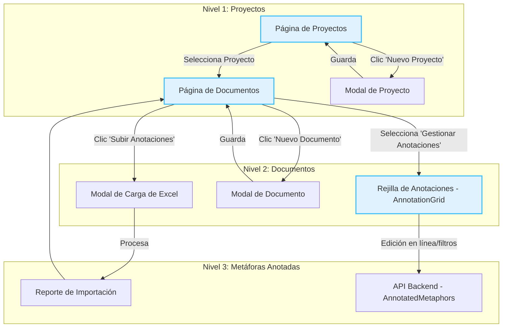

# Análisis del Flujo de la Aplicación: Proyectos, Documentos y Metáforas Anotadas

## Visión General

La aplicación está diseñada como una herramienta de investigación para lingüistas y analistas. Permite organizar el trabajo en **Proyectos**, donde cada proyecto contiene **Documentos** fuente. El núcleo del sistema es la capacidad de analizar estos documentos para identificar, clasificar y anotar **Metáforas Conceptuales**.

El flujo es jerárquico y sigue una lógica clara: `Proyectos > Documentos > Metáforas`.

---

## Diagrama del Flujo Principal

---

## Nivel 1: Proyectos

Es el contenedor principal del trabajo. Un proyecto agrupa un conjunto de documentos relacionados con una misma investigación.

**Funcionalidad:**
- **Listar Proyectos:** La página de inicio (`/projects`) muestra todos los proyectos existentes en forma de tarjetas (`ProjectCard.tsx`).
- **Crear y Editar:** A través del modal `ProjectModal.tsx`, los usuarios pueden crear nuevos proyectos o editar los existentes (título y descripción).
- **Navegación:** Al hacer clic en una tarjeta de proyecto, el usuario navega a la página de documentos de ese proyecto.

**Componentes Técnicos:**
*   **Frontend:**
    *   `pages/projects/index.tsx`: Página principal que lista los proyectos.
    *   `components/ProjectCard.tsx`: Tarjeta individual para cada proyecto.
    *   `components/ProjectModal.tsx`: Formulario para crear/editar proyectos.
*   **Backend:**
    *   `projects.controller.ts`: Expone los endpoints para `GET /projects`, `POST /projects`, `PATCH /projects/:id`.
    *   `projects.service.ts`: Lógica de negocio para interactuar con la base de datos.
    *   `schemas/project.schema.ts`: Define la estructura de un proyecto en MongoDB.

---

## Nivel 2: Documentos

Los documentos son los archivos de texto (PDF, TXT) que sirven como fuente para el análisis de metáforas.

**Funcionalidad:**
- **Listar Documentos:** Dentro de un proyecto (`/projects/[projectId]/documents`), se muestran los documentos asociados en tarjetas (`DocumentCard.tsx`).
- **Crear y Editar:** El modal `DocumentModal.tsx` permite crear nuevos documentos (subiendo un archivo y añadiendo metadatos como título, idioma, etc.) o editar los metadatos de uno existente. La subida de ficheros se gestiona a través de Google Cloud Storage.
- **Abrir Documento:** Se puede abrir el archivo original (PDF o TXT) en una nueva pestaña.
- **Flujos de Anotación (Puntos de entrada al Nivel 3):**
    *   **Gestionar Anotaciones:** Abre la `AnnotationGrid`, la interfaz principal de análisis.
    *   **Subir Anotaciones:** Abre el `AnnotationUploadModal` para una importación masiva de metáforas desde un fichero Excel.

**Componentes Técnicos:**
*   **Frontend:**
    *   `pages/projects/[projectId]/documents/index.tsx`: Página que lista los documentos.
    *   `components/DocumentCard.tsx`: Tarjeta individual para cada documento.
    *   `components/DocumentModal.tsx`: Formulario para subir/editar documentos.
    *   `components/AnnotationUploadModal.tsx`: Modal para la importación masiva.
*   **Backend:**
    *   `documents.controller.ts`: Endpoints para `GET`, `POST`, `PATCH`, `DELETE` sobre documentos.
    *   `documents.service.ts`: Lógica de negocio, incluyendo la interacción con Google Cloud Storage para subir y eliminar archivos.
    *   `schemas/document.schema.ts`: Define la estructura de un documento.

---

## Nivel 3: Metáforas Anotadas

Es el corazón de la aplicación. Aquí es donde se realiza el análisis detallado.

**Funcionalidad:**
- **Visualización en Rejilla (`AnnotationGrid`):**
    *   Muestra todas las metáforas de un documento en una tabla densa y personalizable.
    *   Usa paginación, ordenación y filtros del lado del servidor para manejar grandes volúmenes de datos de forma eficiente.
- **Edición en Línea:** Los usuarios con el rol adecuado (`editor`) pueden hacer clic en cualquier celda y editar su valor directamente. Los cambios se guardan de forma asíncrona.
- **Selección y Acciones en Lote:** Permite seleccionar múltiples metáforas para aplicar cambios de estado en bloque (ej. "Aprobar", "Descartar").
- **Importación Masiva (Flujo mejorado recientemente):**
    *   El usuario sube un archivo Excel a través del `AnnotationUploadModal`.
    *   Se muestra feedback en tiempo real durante la carga y el procesamiento en el servidor.
    *   Al finalizar, se presenta un **resumen** claro (éxitos, fallos, advertencias).
    *   Se puede abrir un **reporte detallado** (`ImportReportModal`) con filtros, búsqueda y opción para exportar errores, permitiendo al usuario entender y corregir problemas en sus datos.
- **Exportación:** Permite exportar los datos filtrados de la rejilla a un fichero Excel.

**Entidades Relacionadas (Dominios y POS):**
*   `Source/Target Domain` y `POS` (Part of Speech) son colecciones separadas para garantizar la consistencia.
*   Cuando se importa un Excel, si un dominio o POS no existe, se crea automáticamente (`findOrCreate` en los servicios correspondientes).
*   En la `AnnotationGrid`, las listas de dominios y POS se cargan en los menús desplegables de edición, ordenadas alfabéticamente para facilitar su uso.

**Componentes Técnicos:**
*   **Frontend:**
    *   `pages/projects/[projectId]/documents/[documentId]/annotations.tsx`: Página que renderiza la rejilla.
    *   `components/AnnotationGrid.tsx`: Componente principal que implementa la tabla con `@tanstack/react-table`. Gestiona el estado de la tabla, las llamadas a la API para obtener datos y las funciones de edición.
*   **Backend:**
    *   `annotated-metaphors.controller.ts`: Endpoints para `GET` (con filtros), `PATCH` (edición en línea), `POST` (acciones en lote) y la importación masiva desde Excel (`bulk-import`).
    *   `annotated-metaphors.service.ts`: Lógica de negocio compleja, incluyendo el procesamiento del Excel, la creación "on-the-fly" de dominios/POS y la construcción del reporte detallado.
    *   `domains.service.ts` y `pos.service.ts`: Servicios dedicados para gestionar estas entidades.
    *   `schemas/annotated-metaphor.schema.ts`, `domain.schema.ts`, `pos.schema.ts`: Definen las estructuras de datos.

---

## Conclusión del Análisis

El flujo de la aplicación está bien estructurado y es robusto. La separación en tres niveles (Proyecto, Documento, Metáfora) es lógica y escalable. Las mejoras recientes en el flujo de importación masiva han añadido un nivel de feedback y usabilidad muy necesario, transformando una posible fuente de frustración en una herramienta de diagnóstico potente para el usuario. La arquitectura backend, con servicios dedicados para cada entidad, promueve un código limpio y mantenible. 